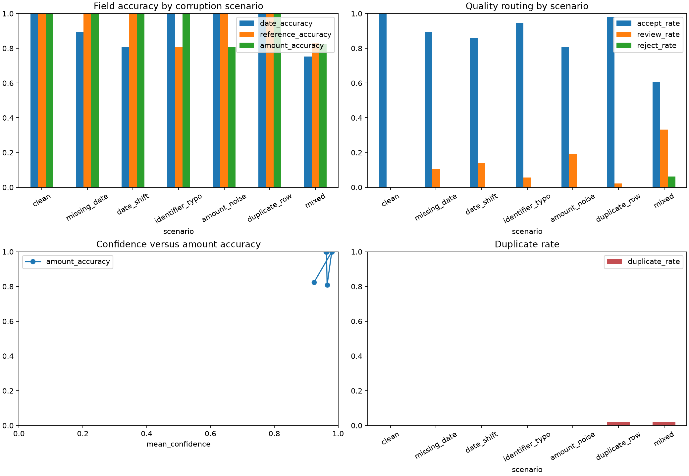

# Document AI Reliability Report

All rows are synthetic. The benchmark compares named corruption scenarios after deterministic normalization and a versioned quality policy.

| Scenario | Date accuracy | Reference accuracy | Amount accuracy | Accept | Review | Reject |
| --- | ---: | ---: | ---: | ---: | ---: | ---: |
| clean | 1.000 | 1.000 | 1.000 | 1.000 | 0.000 | 0.000 |
| missing_date | 0.894 | 1.000 | 1.000 | 0.894 | 0.106 | 0.000 |
| date_shift | 0.808 | 1.000 | 1.000 | 0.862 | 0.138 | 0.000 |
| identifier_typo | 1.000 | 0.808 | 1.000 | 0.944 | 0.056 | 0.000 |
| amount_noise | 1.000 | 1.000 | 0.808 | 0.808 | 0.192 | 0.000 |
| duplicate_row | 1.000 | 1.000 | 1.000 | 0.978 | 0.022 | 0.000 |
| mixed | 0.752 | 0.828 | 0.824 | 0.605 | 0.333 | 0.063 |

## Methodology

1. Generate deterministic document ground truth.
2. Apply one named corruption scenario.
3. Normalize conservative formatting issues.
4. Score fields and duplicates.
5. Route rows through `quality-policy-1.0`.
6. Compare accuracy, confidence, duplicate rate, and routing outcomes.

## Interpretation

- Missing information is not invented by the repair layer.
- Low-confidence or structurally invalid rows are routed to review or reject.
- Scenario-level metrics make failure modes visible instead of hiding them in one aggregate score.
- Confidence is diagnostic and should be calibrated against field correctness before production use.

## Extraction cascade

The synthetic cascade routes low-quality or incomplete primary extraction through a fallback stage and reports the operational trade-offs.

| Metric | Value |
| --- | ---: |
| Fallback rate | 0.448 |
| Page coverage rate | 0.988 |
| Mean latency (ms) | 525.1 |
| Total cost units | 1312.5 |
| Reconciled rate | 1.000 |

The fallback is intentionally more expensive and slower. It is used only when coverage or quality signals justify the operational cost.

## Limitations

This is a synthetic reliability laboratory, not an OCR engine or real-world fairness/performance claim. Production extension points include layout-aware extraction, confidence calibration, human-review cost measurement, source drift monitoring, and representative document governance.
